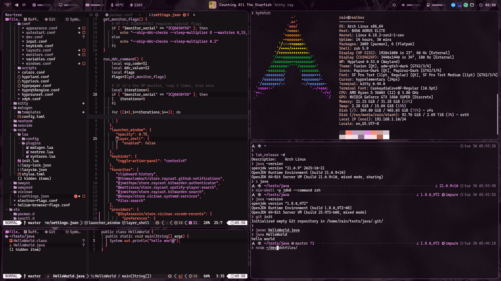

# dotfiles

This repository contains some of my dotfiles and configuration files for my desktop environment.

This is a work in progress and is not complete, they might have some issues, inconsistencies, or missing parts.

I currently use Arch Linux with Hyprland as my desktop environment, but am slowly migrating to Nix (and NixOS) as a secondary environment.
This repository will most likely transition to a mostly Nix-based setup in the future.

